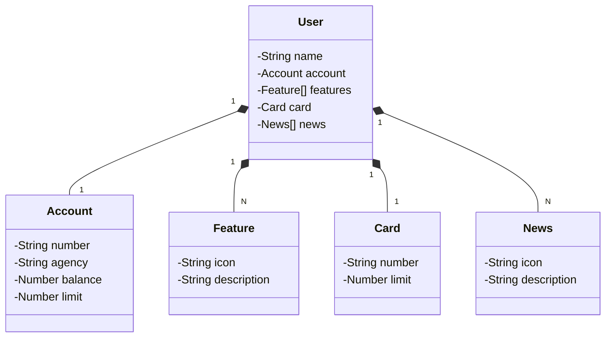

# Santander Dev Week 2024 Java API

RESTful API da Santander Dev Week 2024 construída em Java 17 com Spring Boot 3.

## Principais Tecnologias
- **Java 17**: Utilizaremos a segunda versão LTS mais recente do Java para tirar vantagem das últimas inovações que essa linguagem robusta e amplamente utilizada oferece;
- **Spring Boot 3**: Trabalharemos com a mais nova versão do Spring Boot, que maximiza a produtividade do desenvolvedor por meio de sua poderosa premissa de autoconfiguração;
- **Spring Data JPA**: Exploraremos como essa ferramenta pode simplificar nossa camada de acesso aos dados, facilitando a integração com bancos de dados SQL;
- **OpenAPI (Swagger)**: Vamos criar uma documentação de API eficaz e fácil de entender usando a OpenAPI (Swagger), perfeitamente alinhada com a alta produtividade que o Spring Boot oferece;
- **Railway**: facilita o deploy e monitoramento de nossas soluções na nuvem, além de oferecer diversos bancos de dados como serviço e pipelines de CI/CD.

## [Link do Figma](https://www.figma.com/file/0ZsjwjsYlYd3timxqMWlbj/SANTANDER---Projeto-Web%2FMobile?type=design&node-id=1421%3A432&mode=design&t=6dPQuerScEQH0zAn-1)

O Figma foi utilizado para a abstração do domínio desta API, sendo útil na análise e projeto da solução.

## Diagrama de Classes (Domínio da API)

## Documentação da API (Swagger)

### [https://sdw-2024-prd-lucascismoski.up.railway.app/doc](https://sdw-2024-prd-lucascismoski.up.railway.app/doc)

Esta API ficará disponível no Railway por um período de tempo limitado, mas este é um código-fonte aberto. Portanto, sintam-se à vontade para cloná-lo, modificá-lo (já que é um bom projeto base para novos projetos) e executar localmente ou onde achar mais interessante!

### IMPORTANTE

Esse projeto foi criado com base no bootcamp Santander 2024 - Backend com Java organizado pela Digital Innovation One
(DIO) e apresentado pelo [falvojr](https://github.com/falvojr)
- URL do projeto base: https://github.com/digitalinnovationone/santander-dev-week-2023-api

### Referências

* [Official Gradle documentation](https://docs.gradle.org)
* [Spring Boot Gradle Plugin Reference Guide](https://docs.spring.io/spring-boot/docs/3.3.0/gradle-plugin/reference/html/)
* [Create an OCI image](https://docs.spring.io/spring-boot/docs/3.3.0/gradle-plugin/reference/html/#build-image)
* [Spring Web](https://docs.spring.io/spring-boot/docs/3.3.0/reference/htmlsingle/index.html#web)
* [Spring Boot DevTools](https://docs.spring.io/spring-boot/docs/3.3.0/reference/htmlsingle/index.html#using.devtools)
* [Spring Data JPA](https://docs.spring.io/spring-boot/docs/3.3.0/reference/htmlsingle/index.html#data.sql.jpa-and-spring-data)

### Guias

* [Building a RESTful Web Service](https://spring.io/guides/gs/rest-service/)
* [Serving Web Content with Spring MVC](https://spring.io/guides/gs/serving-web-content/)
* [Building REST services with Spring](https://spring.io/guides/tutorials/rest/)
* [Accessing Data with JPA](https://spring.io/guides/gs/accessing-data-jpa/)

### Links Adicionais

* [Gradle Build Scans – insights for your project's build](https://scans.gradle.com#gradle)

